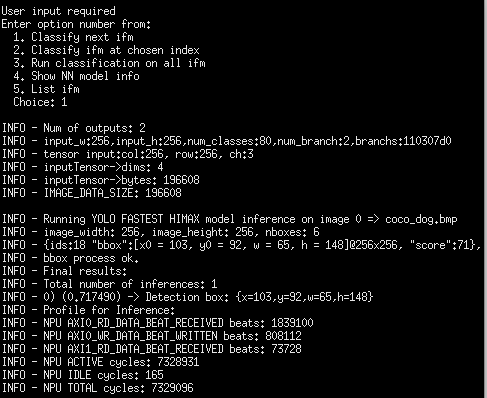
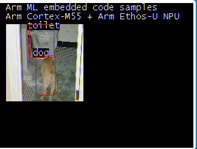

# Deploy examples on FVP simulation environment

- This repository is for building and deploying examples on FVP simulate environment. 
- The example including 
  - [Person detection example without vela](#build-with-person-detection-tflite-model-without-passing-vela): 
    - Input image size: 96 x 96 x 1 (Monochrome)
    - Using google person detection example model without passing vela run inference with cortex-m55.
  - [How to use HIMAX config file to generate vela model](#how-to-use-himax-config-file-to-generate-vela-model)
  - [Person detection example run inference with Ethos-U55 NPU](#build-with-person-detection-tflite-model-passing-vela):
    - Input image size: 96 x 96 x 1 (Monochrome)
    - Using google person detection example model passing vela run inference with Ethos-U55 NPU.
  - [Yolo Fastest Object detection example](#build-with-yolo-fastest-object-detection-tflite-model-passing-vela): (We also provide the [model training example](https://github.com/HimaxWiseEyePlus/Model_Training_Example/tree/main/Yolo_Fastest_series_with_MOT_TF_Keras#tensorflow-keras-yolo-fastestyolo-fastest-xl-with-model-optimization))
    - Input image size: 256 x 256 x 3 (RGB)
    - We only release the model which passes himax_vela.ini (Ethos-U55 64 MACS configuration).
    - We can run infernce using the images which captured by our own HIMAX 01B0 sensor.  
  - [Yolo Fastest XL Object detection example](#build-with-yolo-fastest-xl-object-detection-tflite-model-passing-vela): (We also provide the [model training example](https://github.com/HimaxWiseEyePlus/Model_Training_Example/tree/main/Yolo_Fastest_series_with_MOT_TF_Keras#tensorflow-keras-yolo-fastestyolo-fastest-xl-with-model-optimization))
    - Input image size: 256 x 256 x 3 (RGB)
    - We only release the model which passes himax_vela.ini (Ethos-U55 64 MACS configuration).
    - We can run infernce using the images which captured by our own HIMAX 01B0 sensor.
- To run evaluations using this software, we suggest using Ubuntu 20.04 LTS environment.

## Prerequisites
  - Download the github repository:
    ```
    git clone https://github.com/HimaxWiseEyePlus/ML_FVP_EVALUATION
    cd ML_FVP_EVALUATION
    ```
  - Install the toolkits listed below:
    - Install necessary packages:
      ```
      sudo apt-get update

      sudo apt-get install cmake

      sudo apt-get install curl

      sudo apt install xterm

      sudo apt install python3

      sudo apt install python3.8-venv

      sudo apt-get install libpython3.8-dev
      ```
    - Corstone SSE-300 FVP: aligned with the Arm MPS3 development platform and includes both the Cortex-M55 and the Ethos-U55 processors.
      ```
      # Fetch Corstone SSE-300 FVP
      wget https://developer.arm.com/-/media/Arm%20Developer%20Community/Downloads/OSS/FVP/Corstone-300/MPS3/FVP_Corstone_SSE-300_Ethos-U55_11.14_24.tgz
      ```
      
      ```
      # Create folder to be extracted
      mkdir temp
      # Extract the archive
      tar -C temp -xvzf FVP_Corstone_SSE-300_Ethos-U55_11.14_24.tgz
      ```
      
      ```
      # Execute the self-install script
      temp/FVP_Corstone_SSE-300_Ethos-U55.sh --i-agree-to-the-contained-eula --no-interactive -d CS300FVP
      ```
      
    - GNU Arm Embedded Toolchain 10-2020-q4-major is the only version supports Cortex-M55.
      ```
      # fetch the arm gcc toolchain.
      wget https://developer.arm.com/-/media/Files/downloads/gnu-rm/10-2020q4/gcc-arm-none-eabi-10-2020-q4-major-x86_64-linux.tar.bz2

      # Extract the archive
      tar -xjf gcc-arm-none-eabi-10-2020-q4-major-x86_64-linux.tar.bz2
      ```
    
    - Add `your own gcc-arm-none-eabi/bin path` into PATH environment variable.
      ```
      export PATH="${PATH}:/[location of your GCC_ARM_NONE_EABI_TOOLCHAIN_ROOT]/bin"
      ```
    - Arm ML embedded evaluation kit Machine Learning (ML) applications targeted for Arm Cortex-M55 and Arm Ethos-U55 NPU.
      - We use Arm ML embedded evaluation kit to run the Person detection FVP example.
      ```
      # Fetch Arm ML embedded evaluation kit
      wget https://gitlab.arm.com/artificial-intelligence/ethos-u/ml-embedded-evaluation-kit/-/archive/22.02/ml-embedded-evaluation-kit-22.02.tar.gz

      tar -xvzf ml-embedded-evaluation-kit-22.02.tar.gz
      mv ml-embedded-evaluation-kit-22.02 ml-embedded-evaluation-kit
      cp -r ./source/application/main/include ./ml-embedded-evaluation-kit/source/application/main
      cp -r ./source/application/tensorflow-lite-micro/include ./ml-embedded-evaluation-kit/source/application/tensorflow-lite-micro
      cp -r ./source/profiler/include ./ml-embedded-evaluation-kit/source/profiler
      cp -r ./source/use_case/ad/include ./ml-embedded-evaluation-kit/source/use_case/ad
      cp -r ./source/use_case/asr/include ./ml-embedded-evaluation-kit/source/use_case/asr
      cp -r ./source/use_case/img_class/include ./ml-embedded-evaluation-kit/source/use_case/img_class
      cp -r ./source/use_case/inference_runner/include ./ml-embedded-evaluation-kit/source/use_case/inference_runner
      cp -r ./source/use_case/kws/include ./ml-embedded-evaluation-kit/source/use_case/kws
      cp -r ./source/use_case/kws_asr/include ./ml-embedded-evaluation-kit/source/use_case/kws_asr
      cp -r ./source/use_case/noise_reduction/include ./ml-embedded-evaluation-kit/source/use_case/noise_reduction
      cp -r ./source/use_case/object_detection/include ./ml-embedded-evaluation-kit/source/use_case/object_detection
      cp -r ./source/use_case/vww/include ./ml-embedded-evaluation-kit/source/use_case/vww
      cp -r download_dependencies.py ./ml-embedded-evaluation-kit/
      cp -r set_up_default_resources.py ./ml-embedded-evaluation-kit/
      cd ml-embedded-evaluation-kit/
      rm -rf ./dependencies
      python3 ./download_dependencies.py
      ./build_default.py --npu-config-name ethos-u55-64
      #go out ml-embedded-evaluation-kit folder and copy the example resources to ML embedded evaluation kit
      cd ..
      cp -r ./resources/img_person_detect ./ml-embedded-evaluation-kit/resources
      cp -r ./source/use_case/img_person_detect ./ml-embedded-evaluation-kit/source/use_case
      cp -r ./vela/img_person_detect ./ml-embedded-evaluation-kit/resources_downloaded/
      cp -r ./resources/img_yolofastest_relu6_256_himax ./ml-embedded-evaluation-kit/resources
      cp -r ./source/use_case/img_yolofastest_relu6_256_himax ./ml-embedded-evaluation-kit/source/use_case
      cp -r ./vela/img_yolofastest_relu6_256_himax ./ml-embedded-evaluation-kit/resources_downloaded/      
      cp -r ./resources/img_yolofastest_xl_relu6_256_himax ./ml-embedded-evaluation-kit/resources
      cp -r ./source/use_case/img_yolofastest_xl_relu6_256_himax ./ml-embedded-evaluation-kit/source/use_case
      cp -r ./vela/img_yolofastest_xl_relu6_256_himax ./ml-embedded-evaluation-kit/resources_downloaded/
      ```

## Build with person detection tflite model without passing vela
  - Go under folder of ml-embedded-evaluation-kit
    ```
    cd ml-embedded-evaluation-kit
    ```
  - First, Create the output file and go under the folder
    ```
    mkdir build_img_person_detect && cd build_img_person_detect
    ```
  - Second, Configure the person detection example and set ETHOS_U_NPU_ENABLED to be OFF.And you can run only with Cortex-M55.
    ```
    cmake ../ -DUSE_CASE_BUILD=img_person_detect \-DETHOS_U_NPU_ENABLED=OFF
    ```
  - Finally, Compile the person detection example.
    ```
    make -j8
    ```

## Run with person detection tflite model without passing vela and inference with only Cortex-M55
  - Go out and under the folder of ML_FVP_EVALUATION
    ```
    cd ../../
    ```
  - Run with the commad about
    ```
    CS300FVP/models/Linux64_GCC-6.4/FVP_Corstone_SSE-300_Ethos-U55 ml-embedded-evaluation-kit/build_img_person_detect/bin/ethos-u-img_person_detect.axf
    ```
  - You with see the FVP telnetterminal result below:
   - Start inference: 
      - You will see the input size and tflite op on telnetterminal.
      
   - Run inference: 
      - key-in `1` on telnetterminal and you will start to inference first image with only Cortex-M55. You can see the NPU cycle is 0.
      
      - And you will see the input image on the screen.
      

## How to use HIMAX config file to generate vela model
  - Go under vela folder
    ```
    cd vela
    ```
  - Install necessary package:
    ```
    pip install ethos-u-vela
    ```
  - Run vela with himax config ini file with mac=64 and the person detect example tflite model
    ```
    vela --accelerator-config ethos-u55-64 --config himax_vela.ini --system-config My_Sys_Cfg --memory-mode My_Mem_Mode_Parent --output-dir ./img_person_detect ./img_person_detect/person_int8_model.tflite
    ```
  - You will see the vela report on the terminal: (Notes: `Total SRAM used` less than `900 KB` will be better)
  

## Build with person detection tflite model passing vela
  - Go under folder of ml-embedded-evaluation-kit
    ```
    cd ml-embedded-evaluation-kit
    ```
  - First, Create the output file and go under the folder
    ```
    mkdir build_img_person_detect_npu && cd build_img_person_detect_npu
    ```

  - Second, Configure the person detection example and set ETHOS_U_NPU_ENABLED to be ON.And you can run with Cortex-M55 and Ethos-U55 NPU.
    ```
    cmake ../ -DUSE_CASE_BUILD=img_person_detect \-DETHOS_U_NPU_ENABLED=ON
    ```
  - Compile the person detection example
    ```
    make -j8
    ```

## Run with person detection tflite model passing vela and run inference using Ethos-U55 NPU 
  - Go out and under the folder of ML_FVP_EVALUATION
    ```
    cd ../../
    ```
  - Run with the commad about
    ```
    CS300FVP/models/Linux64_GCC-6.4/FVP_Corstone_SSE-300_Ethos-U55 -C ethosu.num_macs=64 ml-embedded-evaluation-kit/build_img_person_detect_npu/bin/ethos-u-img_person_detect.axf
    ```
    Be careful of the `ethosu.num_macs` number of the MACS at the command. If you use missmatch MACS number with vela model, it will be invoke fail. 
  - You with see the FVP telnetterminal result below:
   - Start inference: 
      - You will see the input size and MACS size on telnetterminal.
      - The tflite op has run with the ethos-u op.
      
   - Run inference: 
      - key-in `1` on telnetterminal and you will start to inference first image with Ethos-U55 NPU. 
      
      - And you will see the input image on the screen.
      


## Build with Yolo Fastest Object detection tflite model passing vela
  - Go under folder of ml-embedded-evaluation-kit
    ```
    cd ml-embedded-evaluation-kit
    ```
  - First, Create the output file and go under the folder
    ```
    mkdir build_img_yolofastest_relu6_256_himax_npu && cd build_img_yolofastest_relu6_256_himax_npu
    ```

  - Second, Configure the Yolo Fastest Object detection example and set ETHOS_U_NPU_ENABLED to be ON.And you can run with only Ethos-U55 NPU.
    ```
    cmake ../ -DUSE_CASE_BUILD=img_yolofastest_relu6_256_himax \-DETHOS_U_NPU_ENABLED=ON
    ```
  - Compile the Yolo Fastest Object detection example
    ```
    make -j8
    ```
## Run with Yolo Fastest Object detection tflite model and inference only using Ethos-U55 NPU 
  - Go out and under the folder of ML_FVP_EVALUATION
    ```
    cd ../../
    ```
  - Run with the commad about
    ```
    CS300FVP/models/Linux64_GCC-6.4/FVP_Corstone_SSE-300_Ethos-U55 -C ethosu.num_macs=64 ml-embedded-evaluation-kit/build_img_yolofastest_relu6_256_himax_npu/bin/ethos-u-img_yolofastest_relu6_256_himax.axf
    ```
    Be careful of the `ethosu.num_macs` number of the MACS at the command. If you use missmatch MACS number with vela model, it will be invoke fail. 
  - You with see the FVP telnetterminal result below:
   - Start inference: 
      - You will see the input size, output tensor size and MACS size on telnetterminal.
      - The tflite op has run with the ethos-u op.
      
   - Run inference: 
      - key-in `1` on telnetterminal and you will start to inference first image with Ethos-U55 NPU. 
      
      - First, you will see the input image on the screen.
      - Then, you will see the detection result with bbox and class on the screen.
      
      - The Himax sensor image result will be the following.
      
      


## Build with Yolo Fastest XL Object detection tflite model passing vela
  - Go under folder of ml-embedded-evaluation-kit
    ```
    cd ml-embedded-evaluation-kit
    ```
  - First, Create the output file and go under the folder
    ```
    mkdir build_img_yolofastest_xl_relu6_256_himax_npu && cd build_img_yolofastest_xl_relu6_256_himax_npu
    ```

  - Second, Configure the Yolo Fastest XL Object detection example and set ETHOS_U_NPU_ENABLED to be ON.And you can run with only Ethos-U55 NPU.
    ```
    cmake ../ -DUSE_CASE_BUILD=img_yolofastest_xl_relu6_256_himax \-DETHOS_U_NPU_ENABLED=ON
    ```
  - Compile the Yolo Fastest XL Object detection example
    ```
    make -j8
    ```

## Run with Yolo Fastest XL Object detection tflite model and inference only using Ethos-U55 NPU 
  - Go out and under the folder of ML_FVP_EVALUATION
    ```
    cd ../../
    ```
  - Run with the commad about
    ```
    CS300FVP/models/Linux64_GCC-6.4/FVP_Corstone_SSE-300_Ethos-U55 -C ethosu.num_macs=64 ml-embedded-evaluation-kit/build_img_yolofastest_xl_relu6_256_himax_npu/bin/ethos-u-img_yolofastest_xl_relu6_256_himax.axf
    ```
    Be careful of the `ethosu.num_macs` number of the MACS at the command. If you use missmatch MACS number with vela model, it will be invoke fail. 
  - You with see the FVP telnetterminal result below:
   - Start inference: 
      - You will see the input size, output tensor size and MACS size on telnetterminal.
      - The tflite op has run with the ethos-u op.
      
   - Run inference: 
      - key-in `1` on telnetterminal and you will start to inference first image with Ethos-U55 NPU. 
      
      - First, you will see the input image on the screen.
      - Then, you will see the detection result with bbox and class on the screen.
      
      - The Himax sensor image result will be the following.
      

## Appendix
  - Add more test image
    - You can add more test image under the file address `ml-embedded-evaluation-kit/resources/img_person_detect/samples`, `ml-embedded-evaluation-kit/resources/img_yolofastest_relu6_256_himax/samples` and `ml-embedded-evaluation-kit/resources/img_yolofastest_xl_relu6_256_himax/samples`. Configure and compile the examples again to test more image.

  - If you want to run the example about the mobilenet image classfication example.
    - Run inference with vela macs=64 or not
      - You should make sure your `ml-embedded-evaluation-kit/source/use_case/img_class/usecase.cmake` is use the vela model is macs 64 or 128 model at line 50.
      - Your building command while using deault macs 64 model will be
        ```
          cmake ../ -DUSE_CASE_BUILD=img_class \-DETHOS_U_NPU_ENABLED=ON \-DETHOS_U_NPU_CONFIG_ID=H64

          make -j8
          ``` 
  - If you want to accelerate the execution time about ethos U55 on FVP, you can add following command at your run command while you execute. The NPU report time is not real while you add following command.
    ```
    -C ethosu.extra_args="--fast"
    ```
    for example
    ```
    CS300FVP/models/Linux64_GCC-6.4/FVP_Corstone_SSE-300_Ethos-U55 -C ethosu.num_macs=64 -C ethosu.extra_args="--fast" ml-embedded-evaluation-kit/build_img_yolofastest_xl_relu6_256_himax_npu/bin/ethos-u-img_yolofastest_xl_relu6_256_himax.axf
    ```
